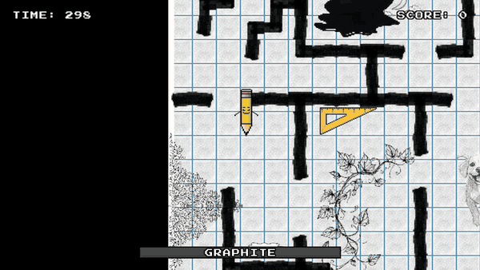
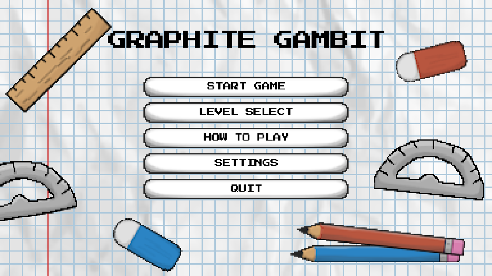
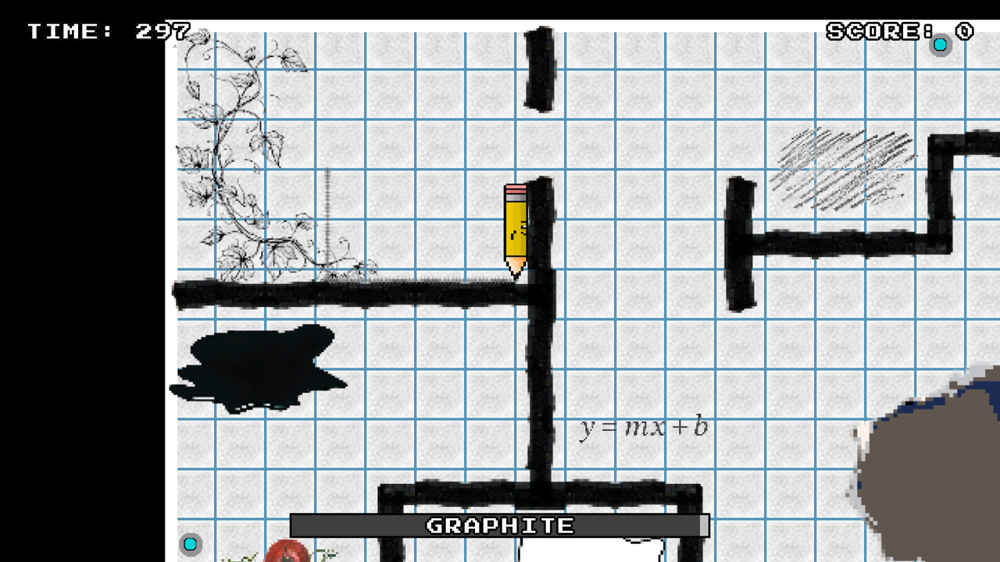
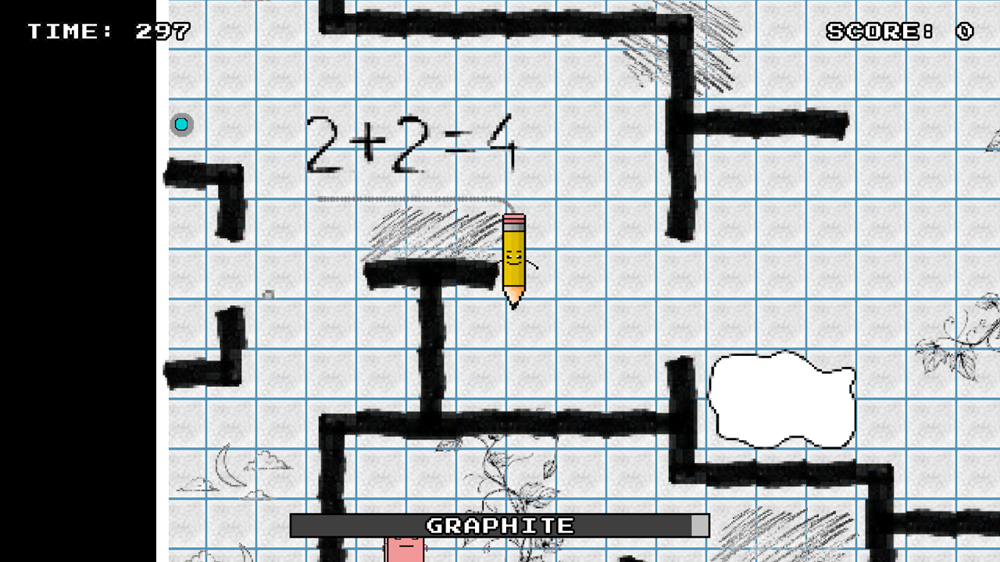

<div align="center">

# ✏️ Graphite Gambit

**A 2D top-down maze game set on a sheet of graph paper. You're a pencil, and every step uses up your graphite.**

Dodge erasers, escape pencil sharpeners, collect plot points, then reach the end cell before the clock or your graphite runs out.

    



<a href="https://www.youtube.com/watch?v=x5MVc6XfxyI"><b>▶ Watch the trailer on YouTube</b></a>

</div>

## Screenshots

<table>
  <tr>
    <td width="50%"></td>
    <td width="50%"></td>
  </tr>
  <tr>
    <td><b>Main menu</b></td>
    <td><b>Level 1</b>, with an ink spill that slows you down</td>
  </tr>
  <tr>
    <td colspan="2"></td>
  </tr>
  <tr>
    <td colspan="2"><b>Level 3</b>: the timer, score and graphite bar are always on screen</td>
  </tr>
</table>

## How to play

| | What it does |
| --- | --- |
| ✏️ **You** | A pencil. Moving uses up graphite, which is also your health. Collect graphite shards to refill it. |
| 🧽 **Erasers** | Chase you through the maze with A* pathfinding and rub out your graphite on contact. |
| 🔪 **Pencil sharpeners** | Trap you and grind your graphite down until you mash your way out. |
| ⚪ **White-out** and ⚫ **ink** | White-out puddles cost graphite. Ink spills slow you down. |
| 📍 **Plot points** | Collect them all to draw a connect-the-dots shape and unlock the end cell. |
| 🏁 **End cell** | Reach it before the 300-second timer runs out. Time left becomes bonus score. |

**Controls:** `WASD` or arrow keys to move · `SPACE` to escape a sharpener · `ESC` to pause

There are three playable levels, plus a fourth "coming soon" teaser.

## Engineering highlights

- **Enemy AI.** Erasers and sharpeners share an abstract `MobileEnemy` base class. It finds paths with **A\*** over the level's tile grid, switches to a **random patrol** when the player is out of sight, and gives subclasses hooks for their own behaviour, so each enemy only implements what makes it different.
- **Data-driven levels.** Levels are designed visually in **Tiled** (`.tmx`). `WorldLoader` reads the tile layers into a collision grid and reads **JSON level files** for entity placement, pickups and spawn rates, so new levels need no code changes.
- **Custom physics.** Velocity, collision against the tile grid and hitbox resolution are done by hand in `PhysicsHandler` and `Transform`, with per-entity collision rules (for example, erasers don't collide with sharpeners).
- **Clean architecture.** Screens go through a singleton `ScreenManager`. Assets are loaded and tracked by an `AssetService`, and sound by an `AudioManager`. Non-player objects share a `Nonplayer` interface instead of a deep class hierarchy, after a deliberate refactor.
- **Tested.** **296 JUnit 5 tests**, using **Mockito** and a headless test mode so game logic runs without opening a window. Several classes (`Door`, `ExitPoint`, `PencilSharpener`) have 100% branch coverage.
- **Designed before it was built.** The project went through use cases, UI mockups, UML and peer code reviews ([`Design/`](Design) and [`Documents/`](Documents)).

## My role

Graphite Gambit was built by a team of five for **CMPT 276 (Software Engineering) at Simon Fraser University**, Spring 2026. My main contributions:

- **World and map system.** I built the Tiled map loader and dynamic level loading, and synced the art with the physics coordinate system.
- **Physics and collision.** Wall collision, hitbox fixes, and a fix for diagonal-strafing and standing-still jitter.
- **Gameplay systems.** Pencil sharpeners, white-out and ink puddles, random graphite spawns, the end cell, and the plot-point connect-the-dots system.
- **Levels 2 and 3, and the HUD** (timer, score and graphite bar), plus the How to Play screen.
- **Refactoring.** I moved duplicated enemy movement into `MobileEnemy`, put shared movement constants in one place, and replaced a confusing object hierarchy with the `Nonplayer` interface.
- **Testing.** I added Mockito to the project, wrote the `WorldLoader` tests (grid logic, collision maths, Tiled property parsing, JSON loading) and the `Player` tests, and brought several classes to 100% branch coverage.

**Team:** Lane Jacobson · Luke McRae · Sergei Naumov · [@Napv2103](https://github.com/Napv2103) · Rishon Ghosh

## Getting started

Requires **JDK 24+** and **Maven**.

```bash
git clone https://github.com/rishon-g/graphite-gambit.git
cd graphite-gambit
mvn clean package
```

Run from the repository root, since levels and assets are loaded by relative path:

```bash
# Windows / Linux
java -jar target/graphite-gambit-1.0.jar

# macOS (GLFW needs the main thread)
java -XstartOnFirstThread -jar target/graphite-gambit-1.0.jar
```

### Tests

```bash
mvn test                      # all 296 tests
mvn test -Dtest=AStarTest     # a single test class
```

## Project structure

```
src/main/java/
├── Game/          # entry point, world, physics, level loading, audio
├── Screens/       # main menu, gameplay screen, screen manager
├── Entities/      # player and enemies (MobileEnemy → Eraser, PencilSharpener)
├── Objects/       # pickups, hazards, doors, plot-point nodes, exit
├── Pathfinding/   # A* and random patrol
├── Components/    # Vec2, Transform, collision corners
├── Asset/         # asset loading and tracking
└── Worlds/        # JSON level data
src/main/resources/
├── maps/          # Tiled maps (.tmx) and tilesets
└── images/ sprites/ audio/ fonts/
```
